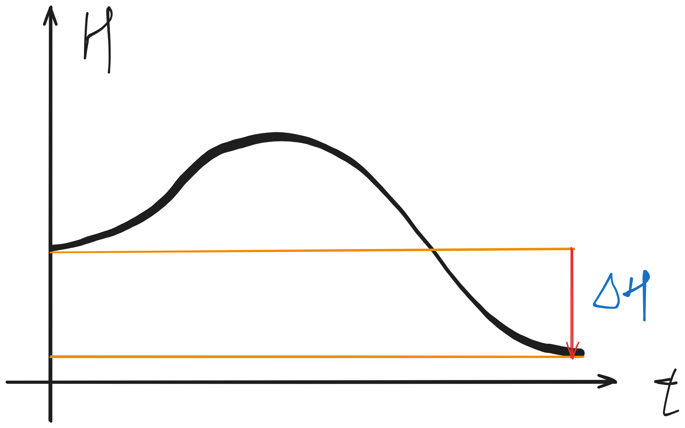

# 物质的结构与性质

## 微观物质结构

## 宏观物质的分类与性质

# 化学反应原理

## 化学反应的能量与方向

### 热化学

#### 化学反应中热量变化的描述

##### 定性认知：吸热反应与放热反应

- 化学上，把释放能量的化学反应称作**放热反应**，把吸收能量的化学反应称作**吸热反应**
- 放热反应：体系向环境释放热能；吸热反应：体系从环境中吸热能
- 本质：化学变化的本质是旧化学键断裂，新化学键生成的过程，化学键断裂需要能量，化学键生成释放能量，断裂所需能量于生成释放的能量不相等，会导致体系反应先后出现能量差

##### 定量实验：反应热与焓变

- 体系的能量——内能$U$

  - 定义：体系内分子动能和分子势能的总和
  - 大小无法测定，但是可以通过其他能量的变化，根据能量守恒定律推出变化量 $\Delta U$
  - 在没有其他能量转化的情况下，可以认为 $\Delta U=Q_p=cm\Delta t$
  - 但是，一般来讲，化学反应是在恒压条件下进行的，如开放容器、燃烧等，此时由于体系会向环境做体积功 $\Delta U\neq Q_p$，因此可以引入一个量，使得在研究热能变化时可以忽略体积功

- 优雅的解决方案——焓 $H$

  - 定义：焓是热力学中为简化**恒压过程**的能量分析而引入的一个状态函数，定义式：$H=U+pV$，其中$pV$项表示因为占有体积、拥有压强从而具有对外做功的潜力
  - 变化量：焓变 $\Delta H$可以真实反映出反应发生时的热能变化

    - 若$\Delta H > 0$系统焓变为正，说明吸收热能，是吸热反应
    - 若$\Delta H<0$系统焓变为负，说明释放热能，是放热反应

- 示例与测定：**中和热**可以表示强酸、强碱的稀溶液生成$1 {\rm mol}$水时释放的能量，如果把能量变成生成每摩尔水时焓的变化值，则其单位变成了$\rm kJ/mol$

  - $\rm H^+ (aq)+OH^-(aq)=\!=\!=H_2O(l) \ \Delta H=-57.3\rm{kJ/mol}$为理论依据
  - 实验装置

- 实验步骤

  - 反应前体系温度的测量

    - 用量筒量取 $\rm 50mL\ \rm 0.50 mol/L$ 盐酸，打开杯盖，倒入量热计的内筒，盖上杯盖，插入温度计，测量并记录盐酸的温度，用水把温度计上的酸冲洗干净，擦干备用；
    - 用另一个量筒量取 $\rm 50mL\ \rm 0.50 mol/L\ \rm NaOH$溶液，用温度计测量并记录$\rm NaOH$溶液的温度；
    - 取两种溶液的温度的平均值作为反应前体系的温度 $T_1$

  - 反应后体系温度的测量

    - 打开杯盖，将量筒中的$\rm NaOH$溶液**迅速**倒入量热计的内筒，立即盖上杯盖，插入温度计，用搅拌器匀速搅拌。密切关注温度不变化，将最高温度记为反应后体系的温度 $T_2$

  - 重复上述步骤1~2次
  - 计算温度差 $\Delta T=T_2-T_1$，进而得出 $Q_p=cm\Delta T$，即可计算中和热，$\Delta H=\frac{Q_p}{n_{H_2O}}$

- 注意事项

  - 测量盐酸的温度后，要将温度计上的酸冲洗干净后，再测量NaOH溶液的温度，避免酸、碱在温度计的表面反应放热而影响测量结果
  - 数据处理时，相差较大的数据可能是偶然误差引起的，应舍去
  - 加过量碱液使酸完全反应，碱过量对中和热测定没有影响
  - 中和热的数值恒定，测定时与强酸、强碱的用量无关
  - 测定中和热不能用弱酸或弱碱，因弱酸、弱碱电离时吸收热量而使测量数值偏低
  - 实验中要用强酸、强碱的稀溶液

    - 如果用弱酸、弱碱，则由于弱酸弱碱电离需要耗能，导致测量结果偏小
    - 如果用强酸、强碱的浓溶液，则由于稀释溶液释放热量，导致测量结果偏大
    - 如果用弱酸、弱碱的浓溶液，那么结果不一定会“负负得正，歪到一起去”

## 反应速率和化学平衡

### 化学反应速率

- 从何而来：我们需要一个物理量，描述一个化学反应进行的有多快，仿照物理中的速度定义，我们可以通过很多指标来描述化学反应的速率
- 如何定义：貌似能够衡量化学反应在一段时间内的指标有很多，比较通用的是物质的量浓度$c$，因为一般的反应容器气相恒压，液相恒容，因此仿照物理的定义，我们可以定义反应速率$v$，单位为$\rm mol/(L\cdot min)$或$\rm mol/(L\cdot s)$，式子中的值均取正值

  $$
  v=\frac{\Delta c}{\Delta t}
  $$

- 一些关系

  - 对于同一个反应$\rm aA+bB=\!=\!=cC+dD$，用不同物质表示的反应速率存在如下关系

    $$
    \frac{v_a}{a}=\frac{v_b}{b}=\frac{v_c}{c}=\frac{v_d}{d}
    $$

    可定义$v_\theta$等于上式的值，为反应绝对速率，可以用于比较某两个反应的速率

- 影响因素

  - 正相关：温度、恒容环境下气体反应的压强、反应物浓度、正催化剂
  - 负相关：恒容环境下气体反应的物质的量、负催化剂（抑制剂）

### 化学平衡

对于**可逆反应**$\rm aA+bB\stackrel{\text{一定条件}}{\rightleftharpoons}cC+dD$，则有如下过程：

1. 投料瞬间，$v_\text{正}$、$c_\text{反}$达到最大值，$c_\text{生}=0$
2. 随着反应进行，$c_\text{反}$减小，$v_正$随之减小；$c_\text{生}$增大，$v_\text{生}$随之增大
3. 肯定有某个瞬间，$v_\text{正}=v_\text{逆}$，此时任何指标将不再变化

此时便是达到了**化学平衡状态**，反应物浓度不再改变，达到**表面静止**的状态，反应物与产物共存

## 离子反应中的平衡体系

## 电化学

#### 两个变化过程：原电池和电解池

##### 原电池

- 定义：**直接**将化学能转化为电能的装置
- 本质：通过装置分离氧化反应与还原反应，使电子转移时经过导线、用电器，释放电能

- 构成条件

  1. 电极能导电，且有电势差（体现为活泼程度）
  2. 有能自发进行的氧化还原反应
  3. 有电解质的溶液或电解质的熔融物
  4. 形成闭合回路

- 正极、负极（以$\rm Zn$、$\rm Cu$、$\rm H_2SO_4$为例）

  - 正极：材料一般更不活泼，发生**氧化反应**，外电路的电子流入这里，内电路的阳离子移向这里，反应方程式为

    $$
    \rm 2H^++2e^-=\!=\!= H_2\uparrow
    $$

  - 负极：材料一般更为活泼，发生**还原反应**，外电路的电子从这流出，内电路的阴离子移向这里，反应方程式为

    $$
    \rm Zn-2e^-=\!=\!=Zn^{2+}
    $$

  - 总反应方程式：

    $$
    \rm Zn+2H^+=\!=\!=Zn^{2+}+H_2\uparrow
    $$

# 无机化学

## 金属元素

### 钠元素

### 铝元素

### 铁元素

## 非金属元素

### 氮元素

### 硫元素

### 氯元素

# 有机化学

## 有机物的分类

## 有机物的结构与性质

## 生命大分子与有机材料

# 化工与环境

## 资源利用

## 绿色化学

# 化学思维与方法

## 实验探究与设计

## 反应分析

## 物质性质预测

## 化学计算