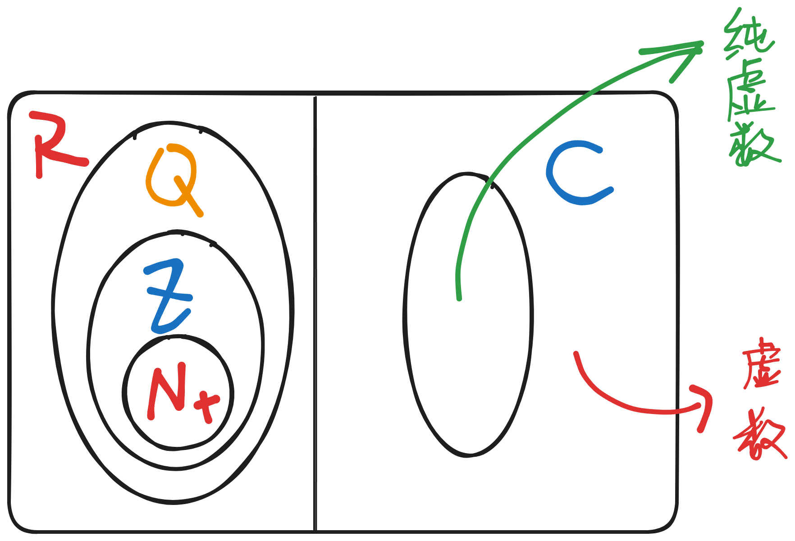
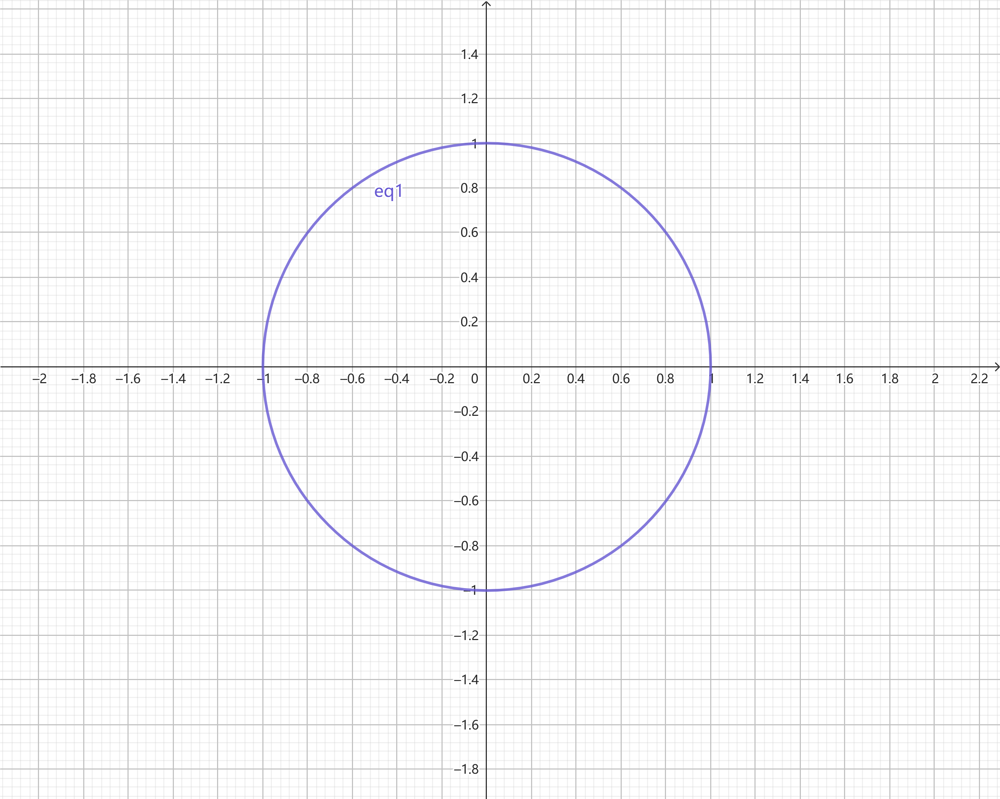
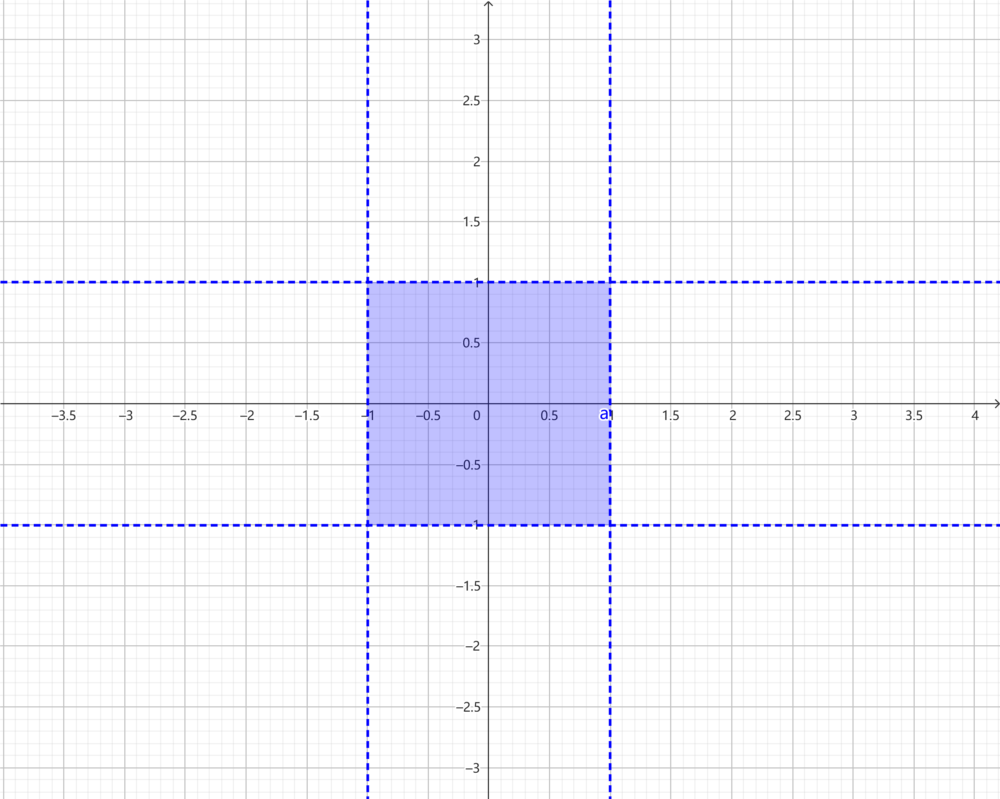

# 数与代数

## 基础理论与运算

### 数

#### 数系的扩充

- 正整数集$\mathbb{N}_+$：最原始的用途——数数（1，2，3，4，5……）
- 自然数集$\mathbb{N}$：0 的出现，用数来表示一个“没有”的状态
- 整数集$\mathbb{Z}$：解决“欠债”问题，使减法可以自由操作
- 有理数集$\mathbb{Q}$：解决“分不均”问题，使除法也可以自由操作
- 实数集$\mathbb{R}$：解决“1—1—?”的直角三角形问题
- 复数集$\mathbb{C}$：解决“$\sqrt{-1}$”的问题，使幂次方、开方可以自由操作

#### 二元数——复数

##### 定义

- 引入新单位：虚数单位$\rm i$，规定$\rm{i}=\sqrt{-1}$
- 生成新的数：$a+bi$，其中$a,b\in \mathbb{R}$，$a$称为这个复数的实部，$b$成为这个复数的虚部
- 表示方法

  - 代数表示：$z=a+b\rm{i}$
  - 三角表示：$z=r(\cos\theta+\rm{i}\sin\theta)$

- 数之间的关系

  - 对于复数$z_1=a+b\rm{i}$、$z_2=c+d\rm{i}$，当且仅当$a=c$且$b=d$时$z_1=z_2$
  - 当且仅当$c=0$且$d=0$时$z_1$与$z_2$可以比较大小，此时$z_1,z_2\in \mathbb{R}$
  - 对于复数$z=a+b\rm{i}$，则记$\bar{z}=a-b\rm{i}$，$\bar{z}$和$z$互为共轭复数

- 凑成新数集：$C=\{x=a+b\rm{i}|a,b \in \mathbb{R}\}$，称其为复数集，对于复数$z=a+b\rm{i}$，有

  - $b=0$时，$z \in \mathbb{R}$
  - $b\neq0$时，$z$称作虚数

    - $a=0$时，$z$为纯虚数
    - $a\neq0$时，$z$只是个虚数

##### 几何意义

- 从何而来：复数是二元数，用一对有序实数$a$和$b$即可表达一个复数$a+b\rm{i}$
- 复数$z=a+b\rm{i}$与有序实数对$(a,b)$一一对应，实数$a$和$b$分别与一个轴上的点对应

  - 复数可以与平面直角坐标系内的点一一对应，可以构建一个平面直角坐标系，用现有的要素可以完美地描述复数

    - x轴 -> 实轴，表示实部
    - y轴 -> 虚轴，表示虚部
    - 平面 -> 复平面
    - 点关于实轴的对称点 -> 该点对应复数的共轭复数对应的点

  - 向量可以用坐标表示，因此可以把复数$z=a+b\rm{i}$用向量$\overrightarrow{OZ}=(a,b)$表示，此时向量$\overrightarrow{OZ}$称作复向量，则可以利用向量的另一个要素——大小（模长），规定复数$z$的绝对值（模长或模）$|z|=|\bar{z}|=|\overrightarrow{OZ}|=\sqrt{a^2+b^2}$
  - 利用向量的**大小、方向**两个要素，可以用模长和三角函数来表达一个复数，其形式为$z=r(\cos\theta+\rm{i}\sin\theta)$，这便得出了复数的三角表示，其中$\theta$为该复数的辐角，取$\theta\in[-\frac{\pi}{2},\frac{\pi}{2}]$，记作$\arg{z}$

- 复平面上的操作

  我们可以用复数天生具有的性质，对复平面上的图形进行描述

  - 复平面内单位圆的描述：$|z|=1$

- 复平面内实心（不包括边界）且边长为2、中心位于原点正方形的描述：$|a|<1,|b|<1$

##### 四则运算与性质

- 加法运算

  - 定义推导

    - 可以利用复向量的加法，对复数 $z_1=a+bi$、$z_2=c+di$的和进行定义：

      $$
      z_1+z_2=(a+c)+(b+d)i
      $$

  - 运算律

    - 交换律：$z_1+z_2=z_2+z_1$
    - 结合律：$(z_1+z_2)+z_3=z_1+(z_2+z_3)$

  - 几何意义

    - 两个复数相加，其和对应的复向量等于两个复数分别对应的复向量按照向量加法法则求和

- 减法运算

  - 定义推导

    - 首先，根据复数减法要向实数兼容的原则，根据实数加减法互换的原理，可以将复数$z_1=a+bi$和$z_2=c+di$的差$z=z_1-z_2$变为关系式$z+z_2=z_1$，可以设$z=x+yi$，根据复数加法法则，可得

      $$
      \begin{cases}
      x+c=a\\
      y+d=b
      \end{cases}
      $$

      解得$x=a-c, y=b-d$，得出对于复数$z_1$、$z_2$减法的定义：

      $$
      z_1-z_2=(a-c)+(b-d)i
      $$

  - 几何意义

    - 两个复数相减，其差对应的复向量等于两个复数分别对应的复向量按照向量减法法则求差

- 乘法运算

  - 定义推导

    - 根据类似于多项式乘法的操作对复数$z_1=a+bi$与$z_2=c+di$的积进行定义

      $$
      \begin{aligned} {} z_1\times z_2&=(a+b\rm{i})\cdot (c+d\rm{i})\\
      &=ac+bd\cdot \rm{i}^2+bc\cdot \rm{i}+bd\cdot \rm{i}\\
      &=(ac-bd)+(ad+bc)\rm{i}
      \end{aligned}
      $$

  - 运算律

    - 交换律：$z_1\times z_2=z_2 \times z_1$
    - 结合律：$(z_1\times z_2)\times z_3=z_1\times (z_2 \times z_3)$
    - 对加法的分配律：$(z_1+z_2)\times z_3=z_1 \times z_3 + z_2 \times z_3$

  - 运算性质

    - 关于共轭复数：对于复数$z=a+b\rm{i}$，有$z\times \bar{z}=a^2+b^2$

  - 几何意义

    - 模长相乘、辐角相加

      $$
      \begin{aligned} {} z_1\times z_2&=[r_1(\cos\theta_1+\rm{i}\sin\theta_1)]\cdot[r_2(\cos\theta_2+\rm{i}\sin\theta_2)]\\
      &=r_1r_2(\cos\theta_1\cos\theta_2-\sin\theta_1\sin\theta_2)\\
      &=r_1r_2[\cos(\theta_1+\theta_2)+\rm{i}\sin(\theta_1+\theta_2)]
      \end{aligned}
      $$

      - 于是乎出现了$\rm i$的魔力转圈圈

- 除法运算

  - 定义推导

    - 继续传统艺能

      $$
      \begin{aligned} {} z_1\div z_2&=\frac{a+b\rm{i}}{c+d\rm{i}}\\
      &=\frac{(a+b\rm{i})\cdot (c-d\rm{i})}{c^2+d^2}\\
      &=\frac{(ac-bd)+(bc-ad)\rm{i}}{c^2+d^2}
      \end{aligned}
      $$

      其中在第一步变形中，我们采用了**分母实数化**的手段，便于我们进行操作

  - 几何意义

    - 模长相除，辐角相减，推导同上

## 方程与不等式

## 数列与递推

# 几何

## 平面几何

### 平面向量

### 解三角形

### 解析几何

## 立体几何

### 欧几里得空间

#### 元素：点、直线、面

### 空间向量

# 函数与分析

## 函数的概念与基本初等函数

## 函数的性质与导数

## 微积分

# 统计与概率

## 概率模型

## 统计推断

# 数学思想与方法

## 数学逻辑与思想

## 数学证明方法

## 数学建模与实践