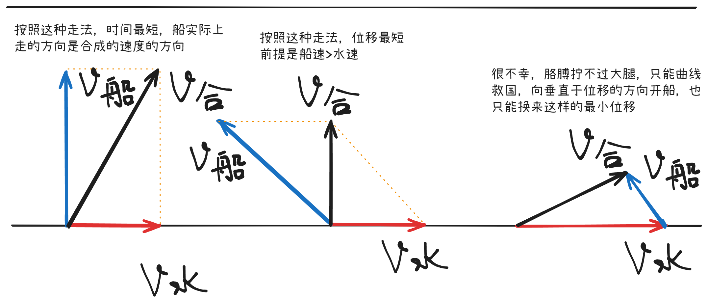
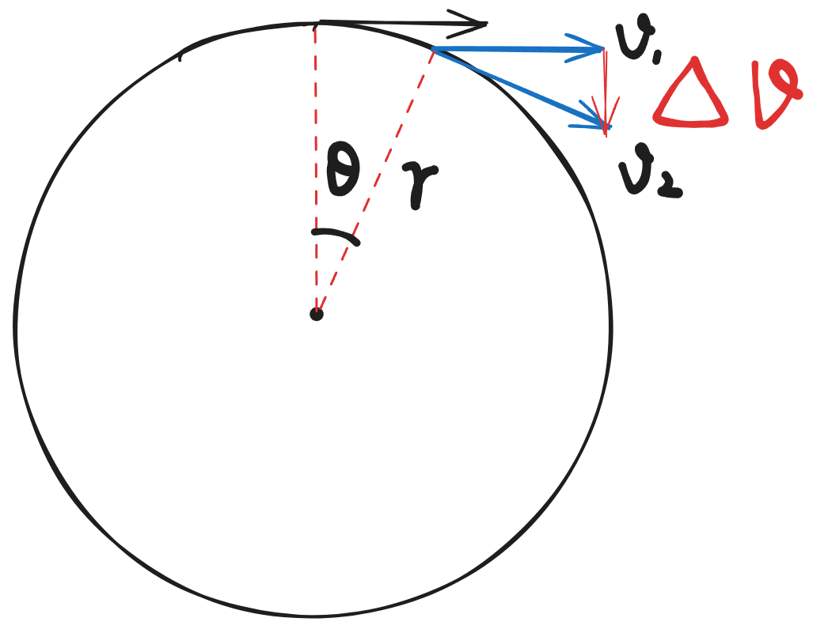
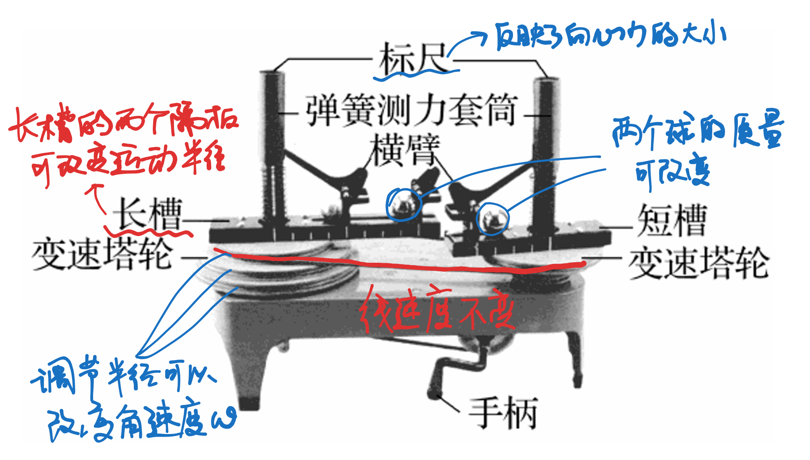
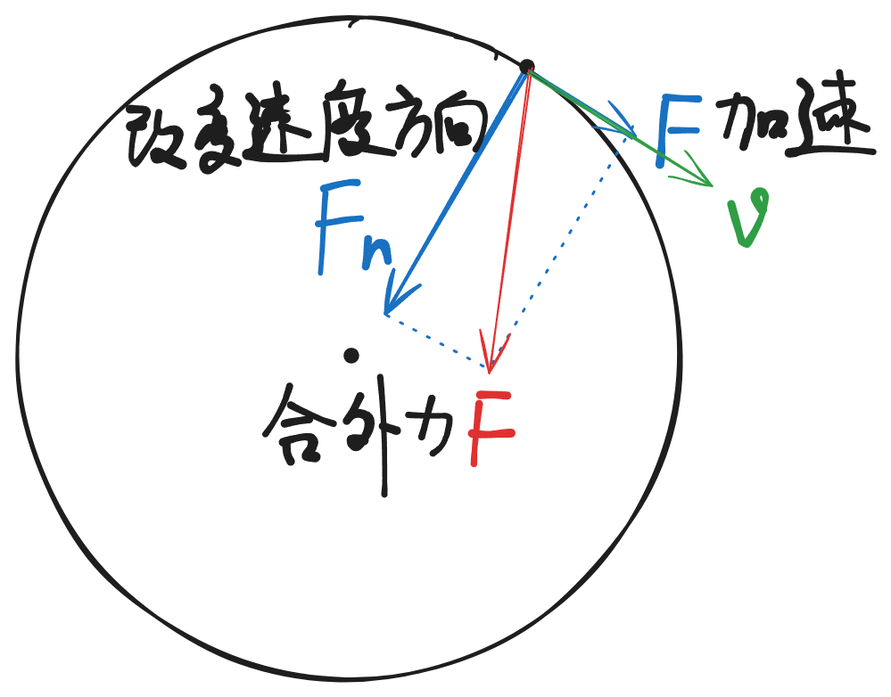
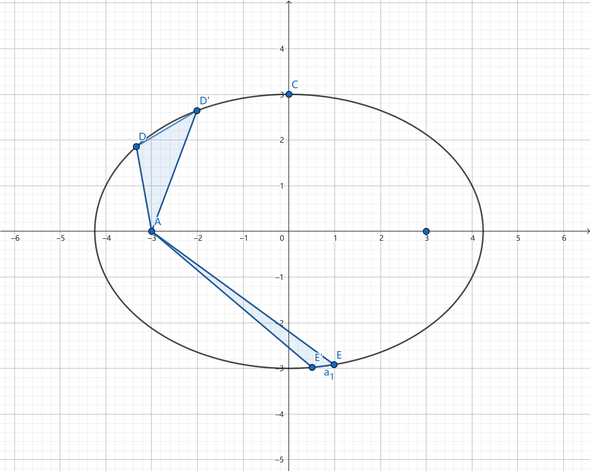
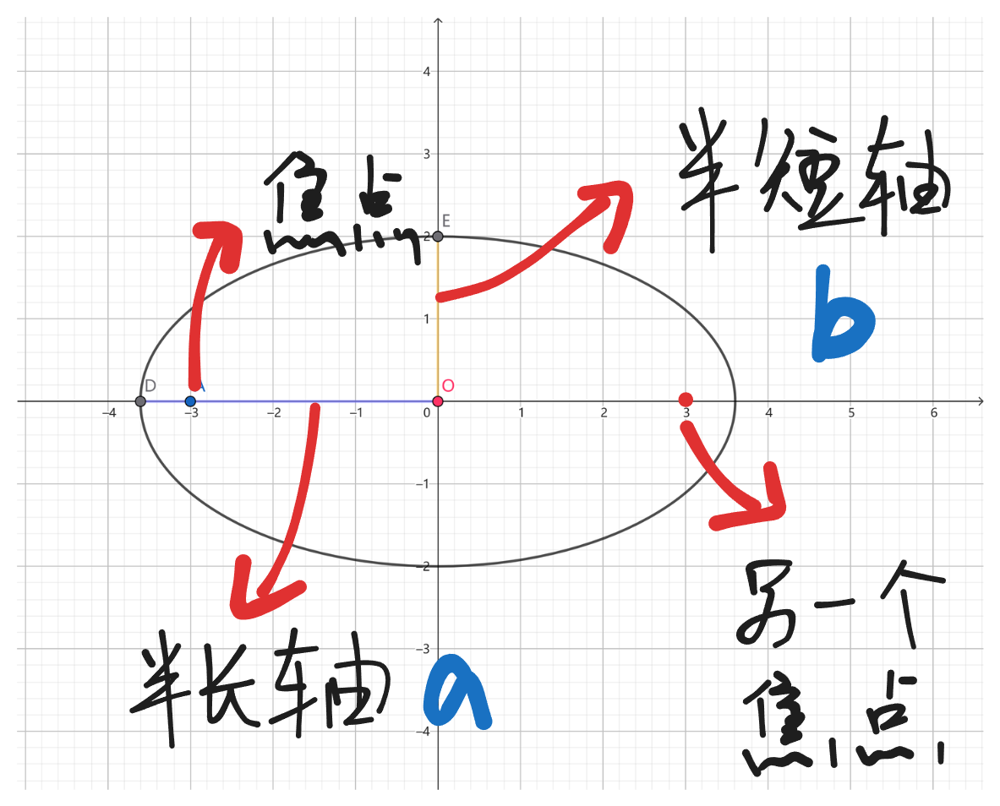
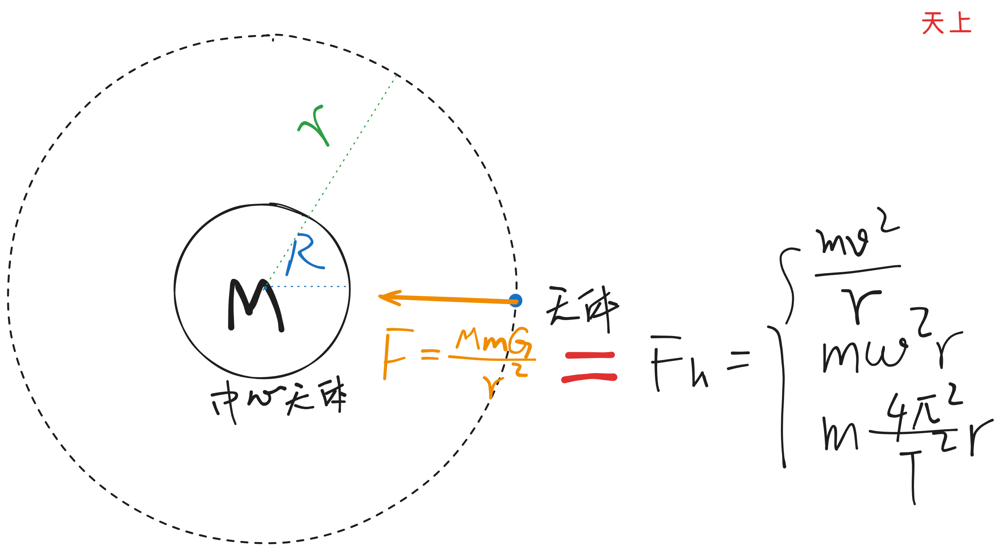
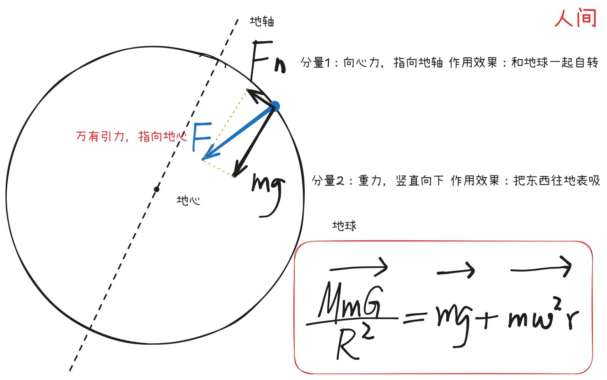

# 力学与运动

## 运动学

### 直线运动：匀变速直线运动

### 曲线运动

- 曲线运动概述

  - 定义：物体运动的轨迹为曲线的运动
  - 物理量

    - **（线）速度** $v$方向时刻变化，为曲线上该点的切线方向，故曲线运动一定是变速运动
    - **位移** 为起点到终点的有向线段，曲线的割线

  - 构成条件

    - 合外力与速度不在同一直线上

  - 轨迹特点

    - 轨迹在力和速度之间夹着，偏向力的一侧
    - 力指向轨迹的凹侧

- 研究技巧：运动的合成与分解

  - 概念

    - 合运动：实际的运动
    - 分运动：物体参与的运动

  - 运算法则：平行四边形法则
  - 性质

    - **等时性** 各分运动和合运动是同时发生的
    - **独立性** 分运动之间相互独立，不互相影响
    - **等效性** 合运动与各个分运动总合的作用效果相同
    - **同体性** 合运动与各个分运动是针对于同一研究对象而言的

  - 应用实例（跳过受力，直接利用运动学手段分析）

    - 小船渡河问题

      - 注意合运动与分运动的本质区别

    - 绳杆末端速度分解问题

      - 同一根绳/杆上受力相同
      - 两个速度的作用效果：拉/推、转

#### 抛体运动

- 一般抛体运动的处理方法

  - 斜抛运动 -> 匀速直线运动+竖直上抛运动
  - 平抛运动 -> 匀速直线运动+自由落体运动

    由于研究思想类似，都是**化曲为直**，故此处主要研究平抛运动

- 平抛运动

  - 实验探究

    - 分开实验：按照 x、y 方向上分开进行实验操作并加以验证

      - x 方向上 ->  **匀速直线运动** 

        - 方法一

          - 逐差法确定等时间，等时间确定匀速直线运动
          - 反向利用逐差法，设法得到水平方向上等时间间隔的位置
          - 通过位置计算每个时间间隔内的位移
          - 通过计算位移差，再使用逐差法公式即可得出加速度为$0$，即做匀速直线运动$\Delta x=aT^2$

        - 方法二：频闪照相

      - y 方向上 ->  **自由落体运动** 

        - 方法一：定性测定（初阶）

          - 同时释放两个小球，在保证其它量不变的情况下水平初速度不同

        - 方法二：频闪照相

    - 在一起实验：用现代手段建立二维坐标系，测定每个时间下的位置

      - 核心：分析轨迹
      - 抓手：x方向上的位移，可以求出来初速度、时间等物理量
      - 求单点速度：逐差法、$v_{\frac{t}{2}}=\frac{v_0+v}{2}$

  - 应用

    化曲为直，建立坐标系，抓住初始量和最终量（位移和速度）

    竖直位移定时间，水平位移定初速度

  - 推论

    $$
    \because \tan \theta = \frac{gt}{v_0} ,\ \tan \varphi = \frac{gt}{2v_0} \\
    \therefore\tan \theta = 2\tan \varphi
    $$

    - 速度与水平方向夹角正切值等于2倍的位移与水平方向的夹角正切值
    - 速度的反向延长线过水平位移的中点
    - 任意时间内的速度变化量方向都是竖直向下，都是时间间隔倍的重力加速度

#### 圆周运动

- 圆周运动的处理办法

  > 天啦噜，速度方向一直在变变变，没法研究
  > 
  > 天啦噜，加速度方向好像也在转转转

  所以我们另起炉灶，另外弄一套东西研究圆周运动吧

  - 物理量

    - **线速度** $v$定义式$v=\frac{\Delta v}{\Delta t}$，单位$\rm m/s$，方向沿该点切线
    - **角速度** $\omega$定义式 $\omega=\frac{\Delta \theta}{\Delta t}$，单位$\rm rad/s$，方向需要用右手定则判定
    - **周期** $T$表示转一圈所用时间
    - **向心力** $F_n$是物体完成圆周运动时指向圆心、改变**速度方向**的力，单位$\rm N$

##### 匀速圆周运动

- 公式及其推导

  - $\vec{v}=\vec{\omega} \times \vec{r}$（注意叉乘，以下忽略矢量性）

    1. 根据周期定义可得大小关系

       $$
       v=\frac{2\pi r}{T}\\
       \omega=\frac{2\pi}{T}
       $$

       那么就可以得到大小关系

       $$
       v=wr
       $$

    2. 结合矢量性可得原式

  - $a_n=\omega v$（得出的结果指向匀速圆周运动的圆心）

    1. 作图，假装动了一点点，那个弧我们就当三角形一条边吧
    2. 可见图中出现了相似三角形耶，列式吧

       $$
       \frac{\Delta v}{r \theta}=\frac{v}{r} \\
       \Delta v=\omega v\Delta t\\
       a_n=\frac{\Delta v}{\Delta t}=\omega v
       $$

    3. 哇偶，这个式子也太好了吧，我们先把向心加速度的推完吧

       $$
       \begin{aligned}
       a_n=& \omega v \\
       = & \omega^2r \\
       = & \frac{v^2}{r}\\
       = & \frac{4\pi^2}{T^2}r
       \end{aligned}
       $$

    4. 那么向心力

       $$
       \begin{aligned}
       F_n=&m \omega v \\
       = &m \omega^2r \\
       = &m \frac{v^2}{r}\\
       = &m \frac{4\pi^2}{T^2}r
       \end{aligned}
       $$

- 匀速圆周运动的运动规律

  - 同轴转动：$\omega$相同
  - 皮带传动：$v$相同

- 向心力大小的实验测定（一图看懂，注意控制变量）

##### 变速圆周运动

合外力不指向圆心，沿速度方向、垂直速度方向分解，分量之一为向心力

##### 离心运动、近心运动

根据向心力的公式，可以定性得出

- $F_\text{合}>F_n$时，合外力垂直于速度方向上供给的力大于所需向心力，质点就要靠近圆心
- $F_\text{合}=F_n$时，合外力垂直于速度方向上供给的力恰好等于所需向心力，皆大欢喜，就这样动了
- $F_\text{合}<F_n$时，合外力垂直于速度方向上供给的力小于所需向心力，质点只想远离圆心

##### 圆周运动的应用

在生活中，我们可以把一般的曲线轨迹拆分为许多圆弧轨迹，再按照以下步骤分析 

1. 先确定运动平面，找到运动半径
2. 通过数学手段进行正交分解等，得到合外力
3. 根据合外力和做圆周运动所需的向心力的关系，得出运动状态

- 应用实例

  - 火车转弯问题

    - 火车轨道设计为倾斜的，目的不是改变运动的平面，而是使得火车在设计速度  
    - 小于设计速度时，挤压内轨，反之挤压外轨

  - 拱桥和过水路面

    - 过水路面需要承载的压力大于车的重力，车的重力大于拱桥承载的压力

  - 圆锥摆问题

    - 向心加速度为$g tan\theta$

## 牛顿力学

### 牛顿力学定律

### 踩在巨人的肩膀上：天体运动

#### 巨人：开普勒与第谷

- 简化模型

  - 椭圆轨道 -> 圆轨道
  - 根据开普勒第二定律，椭圆轨道上的变速运动 -> 匀速圆周运动
  - 根据数学几何知识，半长轴 -> 半径$r$

- 科学史

  - 第谷与开普勒：师生关系
  - 第谷：观察天空、测量星体位置、提供模型

    开普勒：计算、拟合一个描述行星运动的模型

  - 第谷死于膀胱破裂（与国王喝酒却不敢上厕所），开普勒自行研究数据
  - 开普勒发现按照第谷的模型描述第谷的数据出现了8′的误差（经后人研究，第谷的误差仅在2′以内），选择坚定相信第谷的数据（妈呀，好深ai厚mei的师fu生fu情）
  - 开普勒自己构造模型拟合，得出了**开普勒三大定律**
  - 牛顿根据**开普勒三大定律**，结合自己的力学定律，得到了**万有引力定律**

- **开普勒三大定律**

  - 文字表述

    - **开普勒第一定律** 天体沿着以中心天体为其中一个焦点的椭圆轨道环绕中心天体运动
    - **开普勒第二定律** 同一个天体与它的中心天体的连线在相等的时间内扫过的面积相等
    - **开普勒第三定律** 围绕同一中心天体的天体其周期平方与其轨道半长轴三次方成正比

  - 定量表述

    - 开普勒第二定律

      - 推导（微元法）

        - 如图，$D,E$两点是行星所在位置
        - 我们假装它们各自走了一小段时间$\Delta T$，$\Delta T \to 0$，各自到达位置$D',E'$
        - 因为$\Delta T$趋近于$0$，因此我们直接把椭圆上弧$DD',EE'$当作线段
        - 记$D$处与天体的距离、速度为$r_1, v_1$，二者夹角为$\theta_1$，$E$处的为$r_2, v_2,\theta_2$
        - 因为两个三角形面积相等，则可得$\frac{1}{2}sin\theta_1v_1r_1=\frac{1}{2}sin\theta_2v_2r_2$

      - 结论

        - 同一天体绕同一中心天体运动，其速度、与中心天体的连线、二者夹角正弦值之积恒定不变，即$sin\theta\cdot vr$不变（本质上是角动量守恒）
        - 如果按照简化模型进行分析，天体速度始终垂直于其与中心天体的连线，$sin\theta=1$，则可认为$vr$恒定不变
        - 在只研究椭圆满足$sin\theta=1$的点时，同上
        - 如果想要究极简化的话，那就是$\stackrel{\rightarrow}{v}\times \stackrel{\rightarrow}{r}$不变

    - 开普勒第三定律

      - 如图，椭圆为天体运行轨道，$\rm OD$为半长轴，$\rm OE$为半短轴，中心天体位于$\rm A$处，则该定律可描述为$\frac{a^3}{T^2}=k$，记中心天体质量为$M$，根据牛顿的万有引力定律进一步可知$k\propto M$

#### 万有引力定律：统治天地万物

- 大胆假设

  - 根据简化后的模型，设天体质量为$m$，由于天体做匀速圆周运动，需要向心力，可得

    $$
    F=m\omega^2r=m\frac{4\pi^2}{T^2}r
    $$

  - 根据开普勒第三定律，可得

    $$
    F=m\frac{4\pi^2}{\frac{r^3}{k}}R=\frac{4km\pi^2}{r^2} \\
    F\propto \frac{m}{r^2}
    $$

  - 由于力的作用是相互的，引力是普遍的作用，因此对于中心天体，根据牛顿第二定律，可以作出如下假设

    $$
    F'=F\propto \frac{m}{r^2}\\
    \because F'\propto M\\
    \therefore F=F'\propto \frac{Mm}{r^2}
    $$

  - 将其写为等式形式为

    $$
    F=G\frac{Mm}{r^2}
    $$

    其中$G$为引力常量，大小约为$\rm 6.67\times 10^{-11}N\cdot m^2/kg^2$，由卡文迪许的扭秤实验测出

- 小心求证：月—地检验

  - 为了进一步检验定律，根据目前提出的假说，地球上苹果掉下来受到的重力与月球受到地球的吸引力做匀速圆周运动的力是同样性质的力
  - 根据牛顿第二定律，可以得出

    $$
    a_{\text{苹果}}=\frac{M_\text{地}G}{R^2} \\
    a_{\text{月球}}=\frac{M_\text{地}G}{r_{\text{地月}}^2} \\
    \because r_{\text{地月}}=60R \\
    \therefore \frac{a_{\text{月球}}}{a_{\text{苹果}}}=\frac{1}{60^2}
    $$

  - 根据匀速圆周运动的加速度计算公式

    $$
    a_{\text{月球}}=M_\text月\omega^2r_{\text{地月}}
    $$

    最后根据$a_{\text{苹果}}=g$可以检验假说内容，最终的结果与假说内容符合得很好

  - 由此，万有引力定律得证

- 后人应用

  - **称量天体质量**

    - 在天上

      - 如图按照简化模型进行受力分析，如果天体围绕中心天体做匀速圆周运动，则向心力等于万有引力，可推导出如下关系（高轨低速大周期）

        $$
        v=\sqrt{\frac{MG}{r}} \\
        \omega=\sqrt{\frac{MG}{r^3}} \\
        T=2\pi\sqrt{\frac{r^3}{MG}} \\
        a=\frac{MG}{r^2}
        $$

      - 以上这组公式不仅适用于计算天体质量，还可用于计算天体公转的速度、角速度、周期、加速度

    - 在人间

      - 一般情况下，不忽略自转，天体表面的物体随着天体自转，以地球为例受力如图
      - 如果忽略天体自转，则物体在天体表面受到的重力等于万有引力，即$mg=\frac{MmG}{R^2}$，则变形可得黄金代换公式，需要注意这个公式只能用于人间情况，即天体表面或者可以看作是在天体表面运动（即靠近地表等字眼）的情况

        $$
        MG=gR^2
        $$

      - 卡文迪许测出引力常量$G$的大小后，宣布自己称量了地球的质量，就是这个道理
      - 图中的向量标识似乎不规范，但是有必要说明它的矢量性，这是矢量的加减法！

  - **宇宙航行**

    - 人造地球卫星

      - 卫星轨道：必须地心位于同一平面内
      - 近地卫星：轨道半径可以视作地球半径，绕地公转周期约$\rm 84min$
      - 同步卫星：轨道位于地球上空约$\rm 36000km$处，其与地面相对静止

    - 宇宙速度

      - 第一宇宙速度

        - 根据“称量天体质量”中的公式，我们可以得出在**地表**刚好做匀速圆周运动的速度$v=\sqrt{\frac{MG}{r}}=\sqrt{\frac{MG}{R}}$，此为第一宇宙速度，大小约为$\rm 7.9km/s$
        - 如果想要实现发射围绕地球做匀速圆周运动的航天器，至少需要达到该速度
        - 该速度是在地球外做匀速圆周运动的航天器的最大速度
        - 如果达不到该速度，在地球上发射的物体将会做近心运动掉到地上（恭喜你，你发射了一个洲际导弹）

      - 第二宇宙速度

        - 如果速度刚刚超过了第一宇宙速度，物体仅仅是在地球表面做匀速圆周运动或者椭圆运动，实际上还在受地球的引力控制
        - 通过机械能守恒定律，可以推出如果物体要完全逃离地球，需要达到第二宇宙速度，大小为$\rm 11.2km/s$

      - 第三宇宙速度

        - 更加推广，如果要逃出太阳系，则需要达到第三宇宙速度$\rm 16.7km/s$

    - 变轨

      - 需要变轨的原因：由于发射的时候高度有限，速度有限，因此发射的火箭只能沿着小半径圆轨道运动，本质上是匀速圆周运动向心力的供需不平衡
      - 变轨的流程

        - 火箭在圆轨道任一点加速，做离心运动，使轨道变为半短轴为原轨道半径的椭圆轨道（增加供，使其满足椭圆轨道的需）
        - 火箭在椭圆轨道的远地点加速，使轨道变为大半径圆轨道（再增加供，使其满足大轨道的需）

  - **发现未知天体** 天王星的轨道算出来有点不对劲，原来是海王星在外面捣鬼，一不小心就发现了海王星
  - **预言哈雷彗星** 哈雷发现1531年、1607年、1682年的彗星好像轨道如出一辙，怀疑是不是同一颗彗星，如果是的话，1758—1759年将会回归，果然有一颗彗星在1759年3月经过近日点

## 相对论时空观与量子力学

- 从何而来：牛顿力学的局限性（仅适用于低速、宏观）
- 高速宏观物体（光速$c$无法忽略）——相对论管

  - 运动的本质是时空的坍缩，不同参考系的光速必定相同，**时间延缓效应**和**长度收缩效应**的公式是通过参考系内相对静止的观察者观察到的值求出参考系外与之高速相对运动的观察者观察到的值，通过铯原子钟实验证明

    $$
    \Delta t=\frac{\Delta \tau}{\sqrt{1-(\frac{v}{c})^2}} \\
    l=l_0{\sqrt{1-(\frac{v}{c})^2}}
    $$

- 微观物体（普朗克常量$\hbar$无法忽略）——量子力学管

  - 没有物体的运动、位置是确切的，整个世界就是一个巨大的概率云图……

- 牛顿力学只是上述理论的特殊情形
  - [x] 用理论描述这个世界
  - [ ] 用一个大一统理论描述整个世界 

## 能量与动量

# 电磁学

## 静电场与电路

## 磁场与电磁感应

## 交流电

# 热学

## 分子动理论、气体定律

## 热力学定律

# 波

## 机械波与声学

## 光学与电磁波

# 核物理

## 裂变与聚变

## 宇宙大爆炸、暗物质

# 物理建模

## 物理建模方法

## 实验与工具

## 数学工具